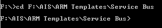

# Introduction: Service Bus

 - Service Bus is a fully managed enterprise integration message broker.
 - Service Bus offers a reliable and secure platform for asynchronous transfer of data and state.
 - Data is transferred between different applications and services using messages.

# Steps to Deploy


### Using :

 - ARM Templates

 - Azure CLI


**Step-1** Establishing connection to Azure portal.

Open CMD.

Use command-
```sh
az login
```
Select the account.


**Step-2** Create ARM templates: 
 
 - Template file : Specify the requirements of the Service to be deployed.
 - Parameters file :  Specify the parameters of the Service to be deployed.  


**Step-3** Create a Resource Group.
Use command-
```sh
az group create --name rsg-use-demo-arm --location "East US"
``` 

**Step-4** Change the diretory.
Change the current directory of the cmd to the location where Template and Parameter file are located.
```sh
cd F:\AIS\ARM Templates\Service Bus
```


**Step-5** Deploy the Service Bus.
 - Give a name to the Deployment.
 - Specify the Resource Group you want to use.
 - Give the name ot the Template file.
 - Give the name ot the Parameter file.
```sh
az deployment group create --name ExampleDeployment --resource-group rsg-use-demo-arm --template-file servicebus.json --parameters servicebus.parameters.json
```

# Conecting to Service Bus using Service Bus Explorer

**Step-1** Get the connection string.
 - Get the Connection String of the Service Bus from Shared access policies.


**Step-2** Connect to service bus
 - Enter the connection string in Service Bus Explorer.


**Step-3** Send messages.
 - Service bus will be connected and appear on the left menu.


 - Right click on the queue and select send messages.


**Step-4** Recieve messages
 - Go to messages and choose from Peek / Recieve and delete


